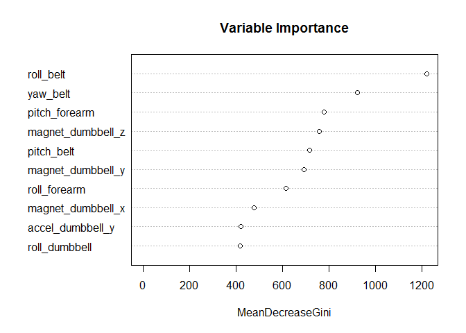
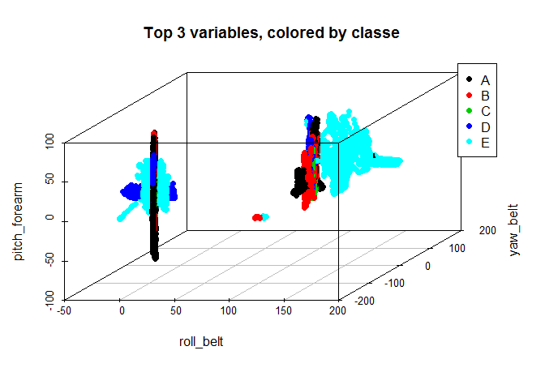

# Practical Machine Learning Course Project: Qualitative Activity Recognition
Tom Tegtmeyer  
April 9, 2016  

# 1: Synopsis
In this assignment, we use a random forest algorithm to create a model that will predict how an exercise was performed based upon various accelerometer measurements. As [described](http://groupware.les.inf.puc-rio.br/har) by the authors, 

> Six young health participants were asked to perform one set of 10 repetitions of the Unilateral Dumbbell Biceps Curl in five different fashions: exactly according to the specification (Class A), throwing the elbows to the front (Class B), lifting the dumbbell only halfway (Class C), lowering the dumbbell only halfway (Class D) and throwing the hips to the front (Class E).

After reducing our training set to 52 predictor variables, we create the random forest model, which has an encouraging 0.29% estimated out-of-bag error rate. Finally, we use our model to predict the classes for a 20-subject test set.


# 2: Downloading and Processing the Data

First, we load the packages we will be using for the analysis.

```r
library(caret); library(randomForest); library(scatterplot3d)
```


Next, we load the training and test sets.

```r
training<-read.csv("https://d396qusza40orc.cloudfront.net/predmachlearn/pml-training.csv")
testing<-read.csv("https://d396qusza40orc.cloudfront.net/predmachlearn/pml-testing.csv")
```

Before creating the prediction model, we need to clean up the dataset. We remove the near zero variance variables. Eliminating the X variable is essential, because it is merely the index value, and the test set has its own indexing. We also remove the user_name, time stamp, and window variables. (We could leave the time stamp and numwindow variables in, but it almost feels like cheating to include them. Indeed, when included, part 1 of the raw time stamp and window number are the most important variables.) Finally, we remove the variables with mostly NA values. As a result, all of the variables used in our model come from actual measurements.


```r
#eliminating the near zero variance variables
nsv<-nearZeroVar(training,saveMetrics = TRUE) 
training<-training[,nsv$nzv==FALSE]
#eliminating the index, username, timestamp, and num_window variables 
training<-training[,-(1:6)]
#eliminating the variables that have mostly NA values
sums<-colSums(is.na(training))
nacols<-as.vector(sums>2)
training<-training[,nacols==FALSE]
```

#3: Creating the model

Now that we have processed the data, we will create a random forest prediction model based on the training data, using the randomForest package. (Note: we are not using train() from the caret package because of performance issues related to the size of the dataset.)


```r
set.seed(125)
training.rf<-randomForest(classe~.,data=training)
training.rf
```

```
## 
## Call:
##  randomForest(formula = classe ~ ., data = training) 
##                Type of random forest: classification
##                      Number of trees: 500
## No. of variables tried at each split: 7
## 
##         OOB estimate of  error rate: 0.29%
## Confusion matrix:
##      A    B    C    D    E  class.error
## A 5578    2    0    0    0 0.0003584229
## B   11 3783    3    0    0 0.0036871214
## C    0    9 3411    2    0 0.0032144944
## D    0    0   21 3193    2 0.0071517413
## E    0    0    1    6 3600 0.0019406709
```

The dataset seems to be particulary amenable to the random forest approach. The confusion matrix reveals a relatively small number of misclassified values in the training set, and the estimated out-of-bag error is a tiny 0.29%. Note that, according to the inventors of the random forest algorithm, [Breiman and Cutler](http://www.stat.berkeley.edu/~breiman/RandomForests/cc_home.htm#ooberr), "In random forests, there is no need for cross-validation or a separate test set to get an unbiased estimate of the test set error." Despite that, for educational purposes, we will run our own cross-validation in the next section.  

Next, we create a plot of the 10 most important variables in the model.


```r
varImpPlot(training.rf, n.var=10, main = "Variable Importance")
```



The following is a 3-dimensional scatterplot of the three most important variables, colored by the "classe" variable. We see a bit of separation in the different groups.


```r
with(training,scatterplot3d(roll_belt,yaw_belt,pitch_forearm,color=as.numeric(classe),pch=19,main="Top 3 variables, colored by classe"))
legend("topright",col=1:6,c("A","B","C","D","E"),pch=19)
```



# 4: Cross-Validation

As mentioned above, to estimate the out of sample error, we perform k-fold cross-validation (with k = 10) on the training set with the random forest algorithm.


```r
set.seed(12321)
#create folds for cross validation
folds<-createFolds(y=training$classe,k=10,list=TRUE,returnTrain=TRUE)
acc<-numeric(10)
for (i in 1:10){
        cv.train<-training[folds[[i]],] #create training set for fold
        cv.test<-training[-folds[[i]],] #create testing set
        cvrf<-randomForest(classe~.,data=cv.train)
        cvpred<-predict(cvrf,cv.test)
        #extract accuracy rate
        acc[i]<-confusionMatrix(cvpred,cv.test$classe)$overall[1]
        print(paste("Accuracy for fold", i, ":", acc[i]))
        rm(cvrf)
}
```

```
## [1] "Accuracy for fold 1 : 0.997450280469148"
## [1] "Accuracy for fold 2 : 0.996432212028542"
## [1] "Accuracy for fold 3 : 0.997451580020387"
## [1] "Accuracy for fold 4 : 0.994903160040775"
## [1] "Accuracy for fold 5 : 0.998470948012232"
## [1] "Accuracy for fold 6 : 0.99796126401631"
## [1] "Accuracy for fold 7 : 0.996432212028542"
## [1] "Accuracy for fold 8 : 0.992868059093225"
## [1] "Accuracy for fold 9 : 0.99796126401631"
## [1] "Accuracy for fold 10 : 0.99847250509165"
```


```r
noquote(paste("Mean accuracy rate: ",mean(acc),sep=""))
```

```
## [1] Mean accuracy rate: 0.996840348481712
```

```r
noquote(paste("Mean error rate: ", round((1-mean(acc))*100,2),"%",sep=""))
```

```
## [1] Mean error rate: 0.32%
```

We see that the mean error rate is close to the out-of-bag error estimate of 0.29% from the randomForest output.

# 5: The Prediction
Applying our random forest model to the test set gives us the following predictions for the "classe"" variable.


```r
pred<-predict(training.rf,testing)
pred
```

```
##  1  2  3  4  5  6  7  8  9 10 11 12 13 14 15 16 17 18 19 20 
##  B  A  B  A  A  E  D  B  A  A  B  C  B  A  E  E  A  B  B  B 
## Levels: A B C D E
```

It is informative to see the "vote" breakdown for each subject in the test set.


```r
pred2<-predict(training.rf,testing,"vote")
pred2
```

```
##        A     B     C     D     E
## 1  0.030 0.860 0.076 0.024 0.010
## 2  0.956 0.026 0.014 0.000 0.004
## 3  0.112 0.718 0.116 0.004 0.050
## 4  0.938 0.008 0.030 0.020 0.004
## 5  0.974 0.008 0.016 0.000 0.002
## 6  0.012 0.078 0.078 0.026 0.806
## 7  0.022 0.006 0.062 0.890 0.020
## 8  0.048 0.766 0.066 0.092 0.028
## 9  1.000 0.000 0.000 0.000 0.000
## 10 0.982 0.016 0.000 0.002 0.000
## 11 0.042 0.848 0.052 0.030 0.028
## 12 0.012 0.042 0.878 0.024 0.044
## 13 0.004 0.990 0.002 0.000 0.004
## 14 1.000 0.000 0.000 0.000 0.000
## 15 0.002 0.022 0.022 0.002 0.952
## 16 0.012 0.022 0.000 0.018 0.948
## 17 0.984 0.000 0.000 0.000 0.016
## 18 0.052 0.850 0.008 0.070 0.020
## 19 0.080 0.892 0.006 0.018 0.004
## 20 0.000 1.000 0.000 0.000 0.000
## attr(,"class")
## [1] "matrix" "votes"
```

```r
apply(pred2,1,max) #find each row maximum
```

```
##     1     2     3     4     5     6     7     8     9    10    11    12 
## 0.860 0.956 0.718 0.938 0.974 0.806 0.890 0.766 1.000 0.982 0.848 0.878 
##    13    14    15    16    17    18    19    20 
## 0.990 1.000 0.952 0.948 0.984 0.850 0.892 1.000
```

This final line of output gives the vote totals for the predicted classes. Note that the minimum of these is 0.718 for subject 3. We can be fairly confident of all of our predictions.
