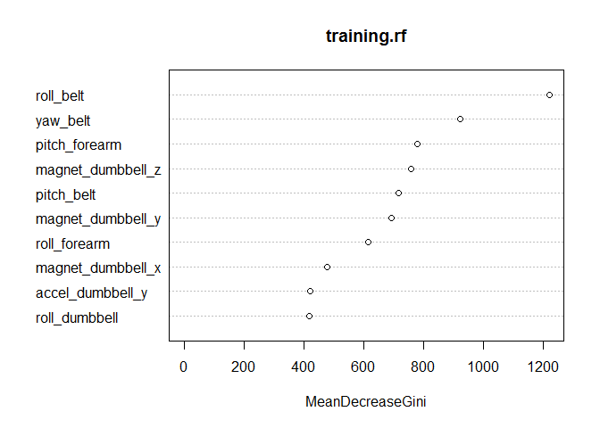

# Practical Machine Learning Course Project
Tom Tegtmeyer  
April 3, 2016  

```r
library(caret);library(randomForest)
```


Here it is

Downloading the training and test sets

```r
training<-read.csv("https://d396qusza40orc.cloudfront.net/predmachlearn/pml-training.csv")
testing<-read.csv("https://d396qusza40orc.cloudfront.net/predmachlearn/pml-testing.csv")
```

Preparing the training set


```r
library(caret)
#eliminating the near zero variables
nsv<-nearZeroVar(training,saveMetrics = TRUE) 
training<-training[,nsv$nzv==FALSE]
#eliminating the index, username, timestamp, new_window, and num_window variables 
training<-training[,-(1:6)]
#eliminating the variables that have mostly na.values
sums<-colSums(is.na(training))
nacols<-as.vector(sums>2)
training<-training[,nacols==FALSE]
```

Creating a random forest prediction model based on the training data.

```r
library(randomForest)
set.seed(125)
training.rf<-randomForest(classe~.,data=training)
print(training.rf)
```

```
## 
## Call:
##  randomForest(formula = classe ~ ., data = training) 
##                Type of random forest: classification
##                      Number of trees: 500
## No. of variables tried at each split: 7
## 
##         OOB estimate of  error rate: 0.29%
## Confusion matrix:
##      A    B    C    D    E  class.error
## A 5578    2    0    0    0 0.0003584229
## B   11 3783    3    0    0 0.0036871214
## C    0    9 3411    2    0 0.0032144944
## D    0    0   21 3193    2 0.0071517413
## E    0    0    1    6 3600 0.0019406709
```

Making predictions

```r
pred<-predict(training.rf,testing)
print(pred)
```

```
##  1  2  3  4  5  6  7  8  9 10 11 12 13 14 15 16 17 18 19 20 
##  B  A  B  A  A  E  D  B  A  A  B  C  B  A  E  E  A  B  B  B 
## Levels: A B C D E
```

```r
pred2<-predict(training.rf,testing,"vote")
print(pred2)
```

```
##        A     B     C     D     E
## 1  0.030 0.860 0.076 0.024 0.010
## 2  0.956 0.026 0.014 0.000 0.004
## 3  0.112 0.718 0.116 0.004 0.050
## 4  0.938 0.008 0.030 0.020 0.004
## 5  0.974 0.008 0.016 0.000 0.002
## 6  0.012 0.078 0.078 0.026 0.806
## 7  0.022 0.006 0.062 0.890 0.020
## 8  0.048 0.766 0.066 0.092 0.028
## 9  1.000 0.000 0.000 0.000 0.000
## 10 0.982 0.016 0.000 0.002 0.000
## 11 0.042 0.848 0.052 0.030 0.028
## 12 0.012 0.042 0.878 0.024 0.044
## 13 0.004 0.990 0.002 0.000 0.004
## 14 1.000 0.000 0.000 0.000 0.000
## 15 0.002 0.022 0.022 0.002 0.952
## 16 0.012 0.022 0.000 0.018 0.948
## 17 0.984 0.000 0.000 0.000 0.016
## 18 0.052 0.850 0.008 0.070 0.020
## 19 0.080 0.892 0.006 0.018 0.004
## 20 0.000 1.000 0.000 0.000 0.000
## attr(,"class")
## [1] "matrix" "votes"
```

```r
print(apply(pred2,1,max))
```

```
##     1     2     3     4     5     6     7     8     9    10    11    12 
## 0.860 0.956 0.718 0.938 0.974 0.806 0.890 0.766 1.000 0.982 0.848 0.878 
##    13    14    15    16    17    18    19    20 
## 0.990 1.000 0.952 0.948 0.984 0.850 0.892 1.000
```

Cross validation

```r
set.seed(12321)
folds<-createFolds(y=training$classe,k=10,list=TRUE,returnTrain=TRUE)
acc<-numeric(10)
for (i in 1:10){
        cv.train<-training[folds[[i]],]
        cv.test<-training[-folds[[i]],]
        cvrf<-randomForest(classe~.,data=cv.train)
        cvpred<-predict(cvrf,cv.test)
        acc[i]<-confusionMatrix(cvpred,cv.test$classe)$overall[1]
        print(paste("Accuracy for fold", i, ":", acc[i]))
        rm(cvrf)
}
```

```
## [1] "Accuracy for fold 1 : 0.997450280469148"
## [1] "Accuracy for fold 2 : 0.996432212028542"
## [1] "Accuracy for fold 3 : 0.997451580020387"
## [1] "Accuracy for fold 4 : 0.994903160040775"
## [1] "Accuracy for fold 5 : 0.998470948012232"
## [1] "Accuracy for fold 6 : 0.99796126401631"
## [1] "Accuracy for fold 7 : 0.996432212028542"
## [1] "Accuracy for fold 8 : 0.992868059093225"
## [1] "Accuracy for fold 9 : 0.99796126401631"
## [1] "Accuracy for fold 10 : 0.99847250509165"
```

```r
print(mean(acc))
```

```
## [1] 0.9968403
```

Plotting the variables of importance

```r
varImpPlot(training.rf, n.var=10)
```



